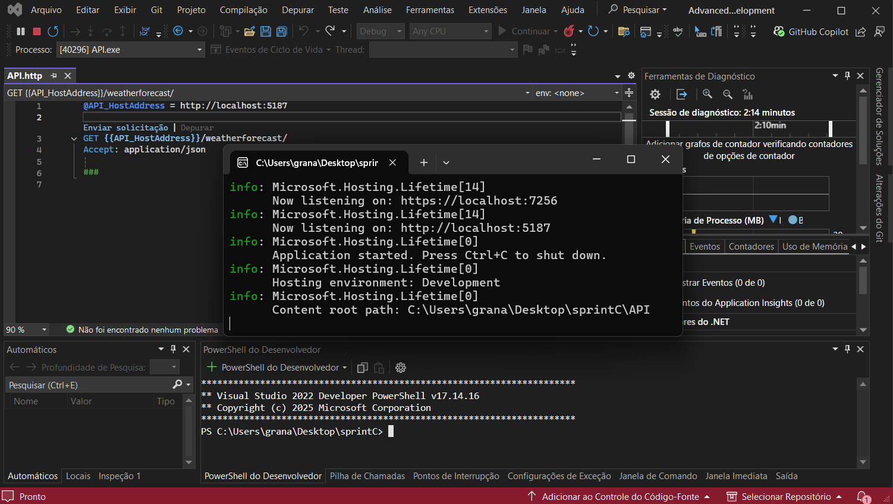
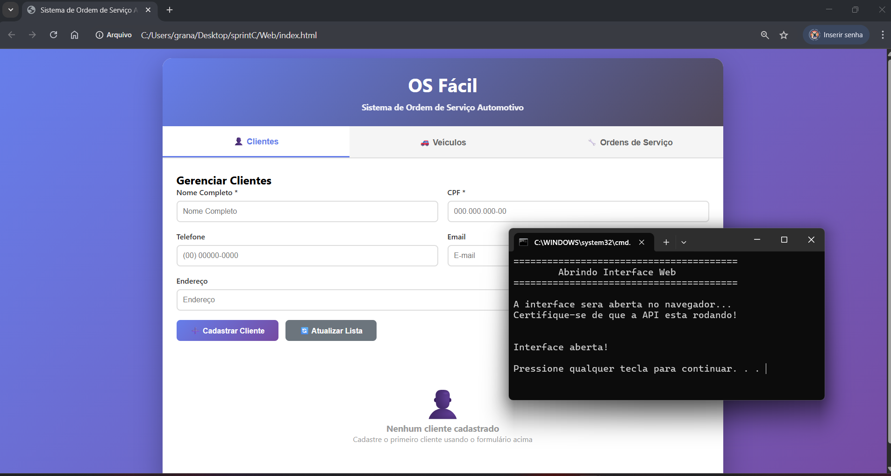
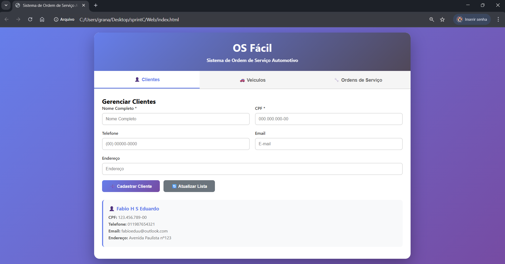
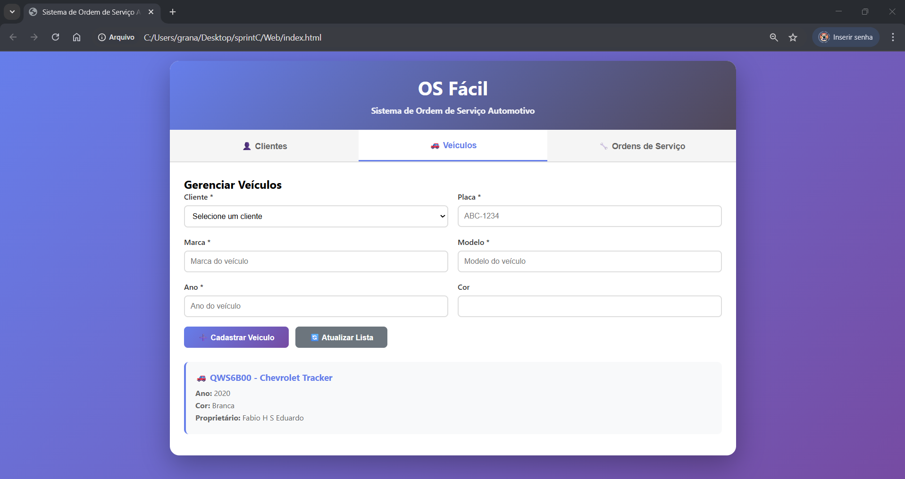
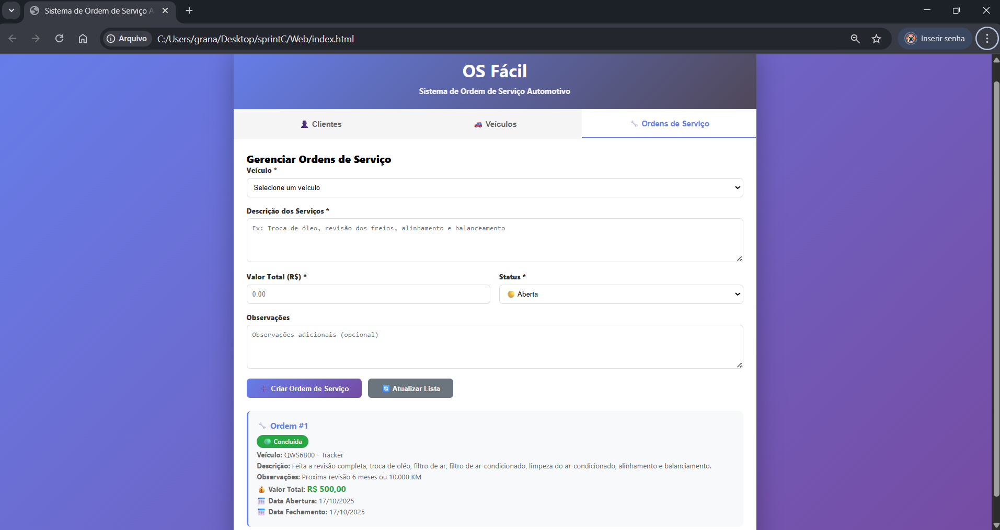

# Sistema de Ordem de Serviço Automotivo

## Definição do Projeto

### Objetivo do Projeto
Esclarecer o problema de gestão de ordens de serviço em oficinas automotivas através de um sistema digital que permite o controle completo do fluxo de trabalho, desde o cadastro do cliente até o fechamento da ordem de serviço.

### Escopo
Delimitar o que será desenvolvido e as funcionalidades principais:
- Cadastro e gerenciamento de clientes com CPF único
- Cadastro e gerenciamento de veículos vinculados a clientes
- Criação e acompanhamento de ordens de serviço
- Adição de serviços às ordens de serviço
- Controle de status das ordens (Aberta, Em Andamento, Aguardando, Concluída, Cancelada)
- Cálculo automático do valor total dos serviços
- Consulta de ordens de serviço por status, período ou veículo

## Demonstração do Sistema

---

### Terminal


---

### Tela Web


---

### Cadastro de Cliente


---

### Cadastro de Veículo


---

### Cadastro de Ordem de Serviço


## Desenho da Arquitetura

### Clean Architecture
Considerar o uso de uma arquitetura limpa para separar responsabilidades e manter o código desacoplado.

### Camadas da Aplicação

#### Aplicação
**Serviços e casos de uso da aplicação:**
- `ClienteService` - Gerenciamento de clientes (criar, consultar, listar)
- `VeiculoService` - Gerenciamento de veículos (criar, consultar, listar)
- `OrdemServicoService` - Gerenciamento de ordens de serviço (criar, consultar, fechar)
- `BaseService` - Lógica comum aos serviços

**DTOs**
- `ClienteDTO` - Transferência de dados de clientes
- `VeiculoDTO` - Transferência de dados de veículos
- `OrdemServicoDTO` - Transferência de dados de ordens de serviço
- `ServicoDTO` - Transferência de dados de serviços

**Manipulação de Erros:**
- `BusinessException` - Exceção customizada para erros de negócio com retorno de erros apropriados

#### Domínio
**Modelos e regras de negócio:**

**Entidades:**
- `Cliente` - Representa um cliente da oficina (Nome, CPF, Telefone, Email, Endereço)
- `Veiculo` - Representa um veículo (Placa, Marca, Modelo, Ano, Cor)
- `OrdemServico` - Representa uma ordem de serviço (Data Abertura/Fechamento, Descrição, Status, Valor Total)
- `Servico` - Representa um serviço realizado (Descrição, Valor, Tempo Estimado)
- `BaseEntity` - Classe base com Id e DataCriacao

**Interfaces de Repositório:**
- `IRepository<T>` - Interface genérica base para operações CRUD
- `IClienteRepository` - Métodos específicos para consulta de clientes
- `IVeiculoRepository` - Métodos específicos para consulta de veículos
- `IOrdemServicoRepository` - Métodos específicos para consulta de ordens de serviço

**Regras de Negócio:**
- CPF do cliente deve ser único
- Placa do veículo deve ser única
- Validação de dados obrigatórios
- Status da ordem de serviço controlado por enum
- Cálculo automático do valor total da ordem de serviço


## Tecnologias Utilizadas

- .NET 9.0
- C# 13
- Entity Framework Core 9.0.10
- SQL Server (Provider do EF Core)
- ASP.NET Core Web API
- HTML5, CSS3, JavaScript ES6+

## Estrutura do Projeto

```
sprintC#/
├── API/
│   ├── Controllers/
│   │   ├── ClientesController.cs
│   │   ├── VeiculosController.cs
│   │   └── OrdensServicoController.cs
│   ├── Program.cs
│   └── API.csproj
│
├── Application/
│   ├── DTOs/
│   │   ├── BaseDTO.cs
│   │   ├── ClienteDTO.cs
│   │   ├── VeiculoDTO.cs
│   │   ├── OrdemServicoDTO.cs
│   │   └── ServicoDTO.cs
│   ├── Services/
│   │   ├── BaseService.cs
│   │   ├── ClienteService.cs
│   │   ├── VeiculoService.cs
│   │   └── OrdemServicoService.cs
│   ├── Exceptions/
│   │   └── BusinessException.cs
│   └── Application.csproj
│
├── Domain/
│   ├── Entities/
│   │   ├── BaseEntity.cs
│   │   ├── Cliente.cs
│   │   ├── Veiculo.cs
│   │   ├── OrdemServico.cs
│   │   └── Servico.cs
│   ├── Interfaces/
│   │   ├── IRepository.cs
│   │   ├── IClienteRepository.cs
│   │   ├── IVeiculoRepository.cs
│   │   └── IOrdemServicoRepository.cs
│   └── Domain.csproj
│
├── Infrastructure/
│   ├── Data/
│   │   └── ApplicationDbContext.cs
│   ├── Repositories/
│   │   ├── Repository.cs
│   │   ├── ClienteRepository.cs
│   │   ├── VeiculoRepository.cs
│   │   └── OrdemServicoRepository.cs
│   ├── ExternalServices/
│   │   └── ExternalApiClient.cs
│   └── Infrastructure.csproj
│
├── Web/
│   ├── index.html
│   └── app.js
│
└── AdvancedBusinessDevelopment.sln
```

## Como Executar

1. Clone o repositório
2. Abra o projeto no Visual Studio 2022 ou VS Code.
3. Restaure os pacotes NuGet:
   ```bash
   dotnet restore
   ```
4. Execute a API:
   ```bash
   cd API
   dotnet run
   ```
5. A API estará disponível em `http://localhost:5187`
6. Abra o arquivo `Web/index.html` em um navegador

## Funcionalidades Implementadas

- Cadastro de clientes com validação de CPF único
- Cadastro de veículos vinculados a clientes
- Criação de ordens de serviço para veículos
- Adição de serviços às ordens de serviço
- Consulta de ordens de serviço
- Fechamento de ordem de serviço com data automática
- Cálculo automático do valor total
- Interface web para operações CRUD
- API REST completa

## Autores

- Fabio H S Eduardo - RM560416
- Gabriel Wu Castro - RM560210
- Renato Kenji Sugaki - RM559810

Projeto acadêmico desenvolvido para a disciplina de Advanced Business Development with .NET
